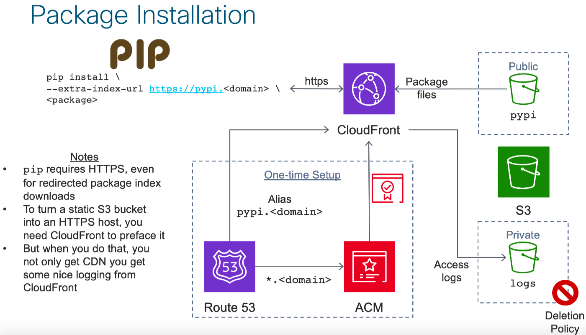
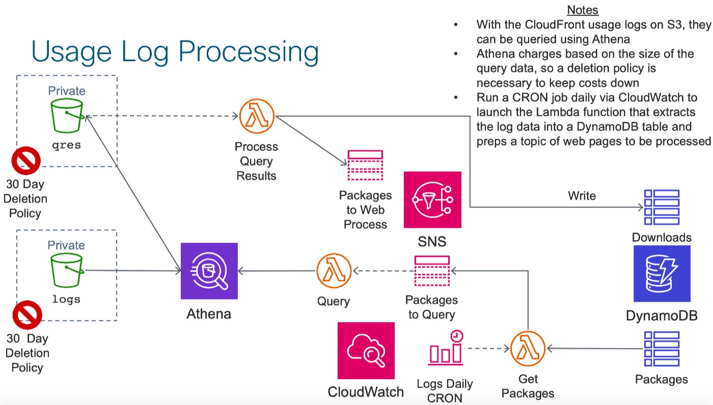
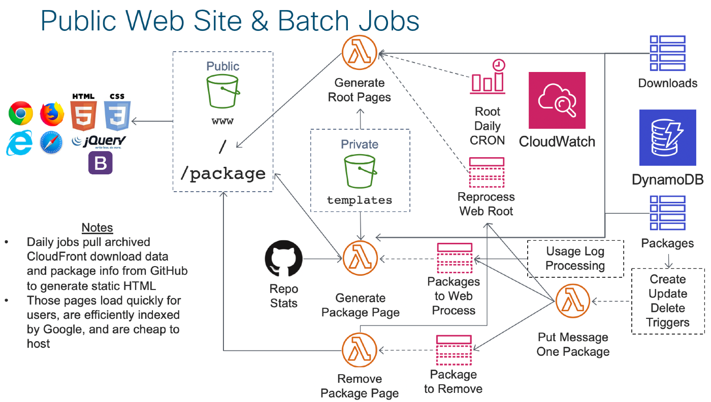
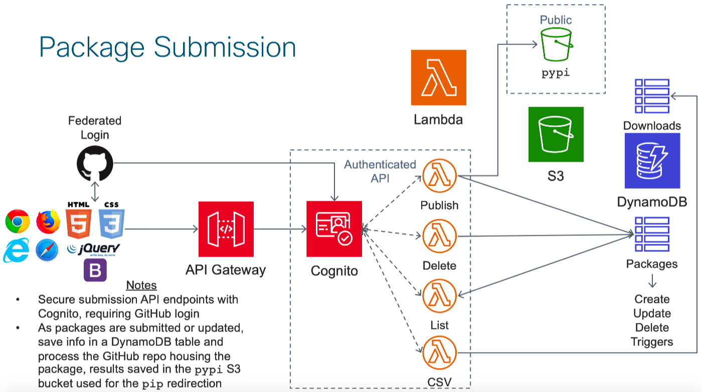

# sls-pypi Architecture
The archiecture of sls-pypi is best thought of in four pieces that serve three different user experiences.  Those user experiences are:

* Submitter
  * Via website after GitHub federated login + extended download stats
* Consumer
  * Package discovery via website search/index
  * Package download via pip

The architecture tackles these three user experiences in reverse order.

## Package download via pip
`pip` offers a `--extra-index-url` flag that can be used to enable the client to talk to multiple pypi back ends.  This can also be configured in `pip.conf` instead of using the flag and makes it easy for existing `pip` users to take advantage of a `sls-pypi` deployment.

`pip` requires HTTPS, however, and while `S3` can easily be used as a static HTTP server that would otherwise be perfect for hosting package files, it requires `CloudFront` configured with an `ACM` certificate in order to make HTTPS possible.  The nice side effect of that is that `CloudFront` has excellent web access logging that not only includes dates and times of download requests, but also POPs used (which can determine where the download went to) and requesting IP address (which can be used outside `sls-pypi` with a whois lookup to get more information about a requester).  This data will be transformed and used in other user experiences.

## Package discovery via website search/index
Data in the `CloudFront` access log is stored compressed in multiple files and in a well known format, making it perfect for `Athena` querying.  That operation can be expensive as the log size grows, however, so a more prudent approach to that data is to run a nightly batch job that extracts data for each package and stores it in `DynamoDB` for less expensive querying later.

This involves three separate `Lambda` functions as the glue between various stages.  A `CloudWatch` cron job starts the process by triggering a function (GetPackages here, `core/batch/listPackages.py` in the code base) that simply iterates over packages in the `DynamoDB` table of packages and for each one, places its name in a `SNS` topic.  That causes as many instances of the Query function (`core/batch/athenaQuery.py`) to launch as their are packages.

In turn, that causes a unique query result from `Athena` to populate the `qres` bucket, each of which triggers an instance of Process Query Results (`core/batch/writeWebLogs.py`) to execute.  That function is responsible for writing log data lazily in the downloads `DynamoDB` table as well as putting a message on the `SNS` topic of package web pages to be re-created with the updated download data.

With download data in a better long term format and storage location as well as triggers in place to re-create package web pages, the remainder of the web processing can be examined.

One approach to populating package specific web pages would have one HTML/CSS/JS page make REST API calls to an `API Gateway` fronted set of `Lambda` functions that then pull data from various sources, including the `DynamoDB` download data.  However, `API Gateway` executions tend to be an expensive operation and a more cost scalable approach is instead to generate static web pages from templates on a nightly basis but put in exceptions for when packages are newly published, updated, or deleted.

This puts the onus of delivering the package-specific pages on `S3` which scales much better cost-wise.  The home page is similarly processed and provides the user with both a search box and a full list of all available packages.

## Via website after GitHub federated login + extended download stats

Finally, the package submittal process utilizes a set of authenticated `API Gateway` fronted `Lambda` functions that federate the user login process with `GitHub`.  Given that far fewer package submittals happen than package downloads or web discovery, the use of `API Gateway` here is difficult to avoid but at least is limited in its scale to limit costs.

Authenticated users are presented with a list of their already submitted packages as well as eligible packages that are publicly available repos on their `GitHub` account.  They are presented with high level usage data and the option of downloading a CSV file with greater detail.
