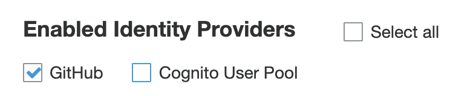

# Serverless PyPi Quickstart

The following are requirements for installing Serverless PyPi:

* [An AWS Account](https://aws.amazon.com/premiumsupport/knowledge-center/create-and-activate-aws-account/)
* [The AWS cli installed](https://docs.aws.amazon.com/cli/latest/userguide/cli-chap-install.html)
* [The SAM cli installed](https://docs.aws.amazon.com/serverless-application-model/latest/developerguide/serverless-sam-cli-install.html)
* [The snyk cli installed](https://snyk.io/docs/cli-installation/)
* [A base domain name registered in Route53](https://docs.aws.amazon.com/Route53/latest/DeveloperGuide/domain-register.html)
* [The Serverless Framework installed](https://serverless.com/framework/docs/getting-started/)
* [An OAuth App created on GitHub](https://developer.github.com/apps/building-oauth-apps/creating-an-oauth-app/)
* [A GitHub access token](https://github.com/settings/tokens)

The installation requires six steps:

## Step 1: Installing Custom CloudFormation Resource Providers
Not all assets required to operate Serverles Pypi can be created and integrated
with one another with standard  CloudFormation constructs.  During this step,
a set of custom CloudFormation Resource Providers will be installed that fill
in the gaps.

Start this process from the root folder of the repo by selecting a bucket name
to store the zip files that house the custom Resource Providers and copying the
 relevant zip files to the bucket:
```
read -p "custom Resource Provider Bucket Name: " BUCKET_NAME
aws s3 mb s3://$BUCKET_NAME
aws s3 cp custom-cf/cfn-certificate-provider-0.2.4.zip s3://$BUCKET_NAME
aws s3 cp custom-cf/cfn-cognito-user-pools.zip s3://$BUCKET_NAME
```
Then, deploy the custom Resource Providers:
```
read -p "domain name: " DOMAIN_NAME
aws cloudformation create-stack \
	--capabilities CAPABILITY_NAMED_IAM \
	--stack-name sls-pypi-cf-resource-providers \
	--template-body file://custom-cf/custom-resource-providers.yaml \
    --parameters ParameterKey=ResourceBucketName,ParameterValue=$BUCKET_NAME \
              ParameterKey=DomainName,ParameterValue=$DOMAIN_NAME
```
## Step 2: Issuing and Validating the HTTPS Certificate
The command line `pip` client requires communication with any back end index repository via HTTPS, which an S3 bucket acting as a static HTTP server cannot support on its own.  Instead, CloudFront can act as the HTTPS front end provided it has a valid certificate.  This step issues that certificate using AWS Certificate Manager and validates it using the DNS record method.

A prerequisite of this step is that a base domain name is being managed by Route 53.  That base domain name and the Hosted Zone ID referencing it in Route 53 are used below.
```
read -p "hosted zone id: " HOSTED_ZONE
aws cloudformation create-stack --stack-name sls-pypi-certificate \
	--template-body file://cf/certificate.yaml \
	--parameters ParameterKey=DomainName,ParameterValue=$DOMAIN_NAME \
		         ParameterKey=HostedZoneId,ParameterValue=$HOSTED_ZONE
```
Check the CloudFormation console and proceed only when this stack has been successfully deployed.  This should take on the order of 5 minutes and its outputs are dependencies for the next step.

## Step 3: Deploying the serverless Pypi index repository
With a valid certificate now available, this step will create an S3 bucket and a CloudFront distribution configured such that they create a valid HTTPS target for `pip`.
```
aws cloudformation create-stack --stack-name sls-pypi-index-repository \
    --template-body file://cf/index-repository.yaml \
    --capabilities CAPABILITY_IAM
```
This creates an S3 bucket named "pypi" + <domain name>, a CloudFront distribution
that fronts the bucket to provide HTTPS and is configured to log access to it,
and a DNS entry that points to the CloudFront distribution.  Completion time on
this step varies according to the CloudFront distribution setup, taking 30 minutes or longer.

## Step 4: Installing and Configuring Federated Login
To make for a better user experience, `sls-pypi` uses a federated login between Cognito
and GitHub.  Unfortunately, Cognito only supports Open ID and GitHub only supports OAuth,
so in order to get the two to talk to each other, `sls-pypi` utilizes [a shim written
by @JonesTim](https://github.com/TimothyJones/github-cognito-openid-wrapper).  Due to this complexity,
this step of the `sls-pypi` installation process requires manual intervention.

The `sls-pypi` repo contains a copy of the @JomesTim as of September 24, 2019 in case he chooses
to shut down his shim project at some point.  The manual steps described here
will be needed to create the Cognito User Pool, set up the GitHub side of the shim, deploy the shim, and then configure the Cognito side of the shim.

### Step 4a: Create a Cognito User Pool
Goto the Cognito Console in the region used for other parts of this installation and create a new user pool to reveal:


Choose a pool name such as `pypi` and click on `Step through settings`.  On the next screen, select `Email address or phone number`:


Accept all the other defaults and skip creating an App Client for now.

With the User Pool created, click on General settings->App clients and click on `Add an app client` to reveal:


BE SURE TO UNCHECK `Generate client secret`!

Give your app client a name such as `pypi` and click the `Create app client` button.

With the app client created, navigate to App integration->Domain name and enter a name such as `pypi` before checking availability and saving.

### Step 4b: Create a GitHub OAuth App
[Follow GitHub's instructions for creating a GitHub OAuth App ](https://developer.github.com/apps/building-oauth-apps/creating-an-oauth-app/). Note that it needs to be an `OAuth App` not the default `GitHub App` when going into `Developer Settings`.  That configuration screen looks like this:


* For the `Application name`, enter `pypi.<your domain>`.
* For the `Homepage URL`, enter `https://pypi.<your domain>/my`.
* For `Application Description`, enter `An independent Python package index`.  
* For the `Authorization callback URL`, use the value of the domain set in step 4a as the base URL followed by `/oauth2/idpresponse`, so `<value of UserPoolDomainUrl>/oauth2/idpresponse`.

Once done, make note of your `client ID` and `secret` as they will be used in the next sub step.

### Step 4c: Deploying the shim
Before being able to deploy the shim, certain configurations should be completed.  In a terminal window, `cd` into the `github-cognito-openid-wrapper` folder and perform the following:
```
cp example-config.sh config.sh
 vim config.sh # Or whatever your favourite editor is
```
This file has been modified compared to the original @JonesTim version given other information already generated in prior steps.  It should read:

```
#!/bin/bash -eu

# Variables always required
export GITHUB_CLIENT_ID=# <GitHub OAuth App Client ID>
export GITHUB_CLIENT_SECRET=# <GitHub OAuth App Client Secret>
export COGNITO_REDIRECT_URI=# https://<Your Cognito Domain>/oauth2/idpresponse

# Variables required if deploying with API Gateway / Lambda
export STACK_NAME=sls-pypi-github-cognito-openid-wrapper
export REGION=# AWS region to deploy the stack and bucket in
```
* For `GITHUB_CLIENT_ID` and `GITHUB_CLIENT_SECRET`, enter the `client id` and `secret` generated by Step 4a.  
* For the `COGNITO_REDIRECT_URI`, enter the same URL used in `Authorization callback URL` for Step 4b.  
* For `REGION`, set equal to the AWS region where `sls-pypi` is being deployed (for example `us-east-1`).

Once your custom `config.sh` is saved, deploy the shim with:

```
npm install
npm run deploy
```
This will download a variety of dependencies and generate some keys prior to performing the deployment.  The `npm install` may initially fail and ask you to run a `snyk wizard` as a security check prior to proceeding as well as potentially `npm audit fix` to fix any vulnerabilities found.

Check `CloudFormationm` for its completion before proceeding to the next sub step.  Note the `Output` value of `GitHubShimIssuer`, which specifies the base API Gateway URL for the newly deployed shim and will be used in the final sub step.

### Step 4d: Configuring Open ID
In your AWS Console, open your user pool and select Federation->Identity Providers to reveal the following:


Click on `OpenID Connect` to reveal the following below the fold of the same window:


* For `Provider name`, enter `GitHub`
* For `Client ID` and `Client secret`, enter the values obtained from your GitHub setup during Step 4a
* For `Authorize scope`, enter `openid read:user user:email`
* For `Issuer` enter the API Gateway URL obtained at the end of Step 4c
  * Next, click on the `Run discovery` button, which will report back that `Discovery has returned no results`.  This is normal and the URLs that Open ID expects to interact with must be entered manually.  The base of each endpoint/URI is the same as the URL you entered for `Issuer` with an additional string appended to the end of it.
  * For `Authorization endpoint`, <your `Issuer` URL>/authorize
  * For `Token endpoint`, <your `Issuer` URL>/token
  * For `Userinfo endpoint`, <your `Issuer` URL>/userinfo
  * For `Jwks uri`, <your `Issuer` URL>/.well-known/jwks.json

Now press the `Create provider` button, which will add a new provider to the list of Open ID providers.

Next, attributes need to be mapped between Open ID and Cognito correctly.  On the left menu, select Federation->Attribute mapping and then the OIDC tab to reveal:


Fill out the list of attributes as follows:


Next, the new `GitHub` identity provider needs to be selected as the default for the App Client and configured.  On the left menu, select App Integration->App client settings and change the `Enabled Identity Providers` checkboxes to read:



Finally, the App Client needs to be configured correctly.


* For both `Callback URL(s)` and `Sign out URL(s)`, enter `https://pypi.<your domain>/my` as you did when setting up GitHub in Step 4b.
* For the `OAuth 2.0` checkboxes, select both `Authorization code grant` and `Implicit grant` and then select all the `Allows OAuth Scopes`.

Your federated login configuration is now complete.

## Step 5: Installing the core components
sls-pypi core components require a GitHub access token with repo:public_repo and the AWS Systems Manager is used to manage that access token securely.  In order for the deployment process to set that access token, open the `github.template` file in the `core` folder, replace the value so that it contains your access token, and save the result as `github.yml`.  Alternatively, set the key to a bogus value for deployment and after the deployment step below completes, manually set the access token in the AWS Systems Manager console.

Then perform the following in the `core` folder:
```
sls deploy
```
This will deploy the final stack, including all the Lambda functions and IAM Roles/Permissions for the functions.

## Step 6: Generating the Base HTML

## Step 7: Testing the deployment
In order to test your deployment, see the two sample packages ([samples101](https://github.com/nerdguru/samples101) and [samples201](https://github.com/nerdguru/samples201)), copy them locally, create your own public repositories of the copy, and try to submit them.

## Congratulations!
You have now deployed `sls-pypi` successfully!  Future updates will likely not require all stacks to be re-deployed.  In most cases, only Step 5 will need to be repeated but check release notes for details.
